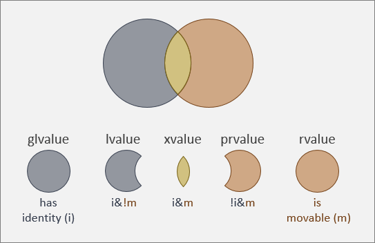

# Value Categories and Reference Binding

## What a value category describes

The examples use C++20/23 unless another version is named. They are independent sketches; string examples use `<string>`, and moving or forwarding uses `<utility>`.

An expression is a piece of code such as `number`, `number + 1`, or `getNumber()`. Its type tells us what kind of value it works with. Its value category helps determine whether it identifies an existing object, produces a value, or offers an object's resources for reuse.

These are different questions. Given `int number = 5;`, both `number` and `number + 1` have type `int`, but the first is an lvalue and the second is a prvalue. Categories describe expressions, so two expressions referring to the same object can have different categories.

Every expression belongs to exactly one of three basic categories: **lvalue**, **xvalue**, or **prvalue**. The other two names are overlapping groups: **glvalue** means lvalue or xvalue, and **rvalue** means xvalue or prvalue. See the [standard's category definitions](https://eel.is/c++draft/basic.lval).

## Reading the identity-and-movability diagram



The supplied diagram accompanies the model explained in [Microsoft's value-category article](https://learn.microsoft.com/en-us/windows/apps/develop/cpp-winrt/cpp-value-categories). In its labels, `i` means identity, `m` means movable, `!` means not, and `&` means both. These labels describe set membership; they are not C++ reference declarations.

Identity means that the expression identifies a particular object, rather than merely computing its contents. Two integers can both contain five and still be different objects. In the diagram, the left circle contains expressions with identity. The right circle groups expressions that can be used as sources for moving. Their intersection is the xvalues.

Treat “movable” as a teaching aid for understanding overload selection, not a guarantee that moving will happen. Constness and the available constructors still matter. An xvalue also need not refer to an object about to be destroyed: `std::move(number)` can refer to a local that will remain alive for a long time.

## lvalue: identifying an existing object

In ordinary expressions, using a variable's name gives an lvalue. Dereferencing a valid object pointer also gives an lvalue. An lvalue does not have to appear on the left of assignment, and it does not have to be writable.

```cpp
int number = 5;
const int fixed = 9;
int* pointer = &number;

number = fixed;  // number and fixed are both lvalue expressions.
*pointer = 12;   // *pointer is an lvalue referring to number.
// fixed = 12;   // Compile error: fixed is const, although it is an lvalue.
```

Taking an address is a useful example of identity, but it is not a complete test for being an lvalue. For example, a bit-field can be an lvalue even though built-in address-taking is forbidden. Conversely, a pointer expression can itself be a prvalue: `&number` computes a pointer value. The thing a pointer points at does not determine the pointer expression's category. See the [address operator rules](https://eel.is/c++draft/expr.unary.op).

## prvalue: computing a value or initializing an object

A prvalue, or pure rvalue, supplies a computed value or initializes a result object. Examples include the integer literal `5`, built-in arithmetic such as `number + 1`, and a function call returning an object by value.

```cpp
int getNumber() { return 7; }

int result = getNumber() + 1; // Both getNumber() and the sum are prvalues.
// int* bad = &getNumber();   // Compile error: built-in & cannot take this prvalue.
```

Do not translate “prvalue has no identity” into “there can be no object or storage.” Since C++17, a class prvalue can initialize its destination directly. If a context needs a temporary object, such as reference binding, temporary materialization creates that object and yields an xvalue identifying it. See [temporary materialization](https://eel.is/c++draft/conv.rval).

```cpp
std::string text = std::string{"hello"}; // Constructs text directly in C++17+.
const std::string& view = std::string{"hello"};
// The second declaration materializes a temporary and binds view to it.
```

In the second declaration, the direct binding extends the temporary's lifetime to the lifetime of the local reference. Reference binding does not always extend lifetime; a reference returned through a function does not renew an argument temporary's lifetime. See [pointers and references](pointers_references.md).

## xvalue: identifying an object as a source for moving

An xvalue has identity, like an lvalue, and belongs to the rvalue group. The name is associated with an expiring value. The common spelling `std::move(object)` produces an xvalue for an ordinary object; it does not destroy that object or transfer anything by itself.

```cpp
std::string original = "hello";
std::string copied = original;             // Copies from an lvalue.
std::string moved = std::move(original);   // Move-constructs from an xvalue.
```

`original` still names the original string object afterward. The move constructor performs the resource transfer; `std::move` only changes how the source expression is presented. For this object, `static_cast<std::string&&>(original)` is another spelling of the relevant cast. See the [move and forward utilities](https://eel.is/c++draft/forward).

A moved-from standard-library object is generally valid but has an unspecified state unless its type promises more. For example, do not assume a moved-from string is empty, but it can be assigned a new value or queried with `empty()`. A moved-from `unique_ptr` specifically becomes empty. Moving does not mean the source object disappears. See the [moved-from library contract](https://eel.is/c++draft/lib.types.movedfrom) and [smart-pointer notes](smart_pointers_move.md).

## Reference types and expression categories are different

`T&` declares an lvalue reference. `T&&` declares an rvalue reference when `T` is a fixed object type. For direct binding to the same underlying object type, these are the common rules:

| Parameter | Non-const lvalue | Const lvalue | Non-const rvalue |
|---|---|---|---|
| `T&` | Binds | Cannot bind | Cannot bind |
| `const T&` | Binds | Binds | Binds |
| `T&&` | Cannot bind | Cannot bind | Binds |

Conversions and forwarding-reference deduction add other cases. `const T&&` is also a valid type: it can bind to suitable rvalues, but cannot ordinarily feed a move operation that needs a non-const `T&&`. See [reference initialization](https://eel.is/c++draft/dcl.init.ref).

A named rvalue-reference variable is an lvalue when used by name in an ordinary expression. Its declared reference type does not make each use of its name an xvalue.

```cpp
int&& reference = 5;
int& alias = reference;             // OK: reference is an lvalue expression.
// int&& other = reference;         // Compile error: cannot bind this way.
int&& other = std::move(reference); // OK: the initializer is an xvalue.
```

These declarations do not move an integer into a new object. They bind references to the same materialized integer. The literal's temporary remains alive for the lifetime extended by the initial local binding.

## Function calls and overload selection

For an ordinary function returning an object type `T`, a call returning `T` is a prvalue, a call returning `T&` is an lvalue, and a call returning `T&&` is an xvalue. This concerns the call expression, not the name of a variable that later stores or refers to its result. See [function call expressions](https://eel.is/c++draft/expr.call).

```cpp
void inspect(const std::string&) { /* Read through a const reference. */ }
void inspect(std::string&&)      { /* May consume a non-const rvalue. */ }

void relay(std::string&& text)
{
    inspect(text);            // Selects const std::string&: text is an lvalue.
    inspect(std::move(text)); // Selects std::string&&: the cast is an xvalue.
}
```

Selecting the second overload does not itself prove that a move occurs. Its body decides whether to construct or assign another object from the argument. Also, `std::move` preserves constness: moving a const string expression cannot bind to the usual non-const string move constructor, so a copy can be selected instead.

The ordinary named-variable rule has specialized exceptions. In C++23, certain local names in return and related contexts are treated as xvalues for implicit moving. This is a reason to use the normal `return local;` form rather than add `std::move` to every return. See [copy elision and NRVO](functions_scope_lambdas.md) and [move-eligible expressions](https://eel.is/c++draft/expr.prim.id.unqual).

## Reference collapsing

Templates and type aliases can combine reference types indirectly. C++ reduces the combination to one reference: if either layer is an lvalue reference, the result is an lvalue reference. Only two rvalue-reference layers yield an rvalue reference.

| Indirect combination | Result |
|---|---|
| `T&` followed by `&` | `T&` |
| `T&` followed by `&&` | `T&` |
| `T&&` followed by `&` | `T&` |
| `T&&` followed by `&&` | `T&&` |

```cpp
using Ref = int&;
int number = 5;
Ref&& alias = number; // Ref is int&, so Ref&& collapses to int&.
```

You cannot write `int& && alias` directly. The table describes combinations formed through mechanisms such as aliases or template substitution. See [reference declarations and collapsing](https://eel.is/c++draft/dcl.ref).

## Forwarding references

In `template<class T> void relay(T&& value)`, `T&&` is a forwarding reference because `T` is a deduced, cv-unqualified function-template type parameter. It can accept both lvalues and rvalues. A fixed `std::string&&` parameter is an ordinary rvalue reference, and `const T&&` is not a forwarding reference.

For an lvalue argument of type `int`, deduction makes `T` be `int&`; collapsing then makes the parameter `int&`. For an rvalue `int`, deduction makes `T` be `int`, giving an `int&&` parameter. See [forwarding-reference deduction](https://eel.is/c++draft/temp.deduct.call).

```cpp
void use(int&)  { /* lvalue case */ }
void use(int&&) { /* rvalue case */ }

template<class T>
void relay(T&& value)
{
    use(std::forward<T>(value));
}

// Inside a calling function:
int number = 5;
relay(number); // Ultimately selects use(int&).
relay(5);      // Ultimately selects use(int&&).
```

Inside the function, `value` is a named expression and therefore an lvalue in the call. `std::forward<T>` uses the deduced type to present it as an lvalue for the first call and an rvalue for the second. Using `std::move(value)` in both cases would offer even the caller's lvalue for moving. Both utilities are in `<utility>`.

## Errors and pitfalls

A string literal such as `"hello"` is an lvalue array, even though integer literals such as `5` are prvalues. For built-in integer operations, `++number` is an lvalue and `number++` is a prvalue. Class operators can have different return types, so classify those through the actual overload. See [expressions](expressions.md).

An xvalue is both a glvalue and an rvalue; those groups are not opposites. Do not use the diagram to conclude that an rvalue is always anonymous, always temporary, or always successfully moved from. `std::move(original)` still identifies `original`.

Keep category, mutability, lifetime, and actual movement separate. A const object can be named by an lvalue. A reference can dangle. A cast can produce an xvalue without moving. None of these categories substitutes for checking whether the object is still alive.

## Interview Q&A

### What are the three basic value categories?

An lvalue identifies an object without presenting it as an expiring source. An xvalue identifies an object whose resources may be reused. A prvalue computes a value or initializes a result object. I classify the expression, not just the variable's declared type.

### How do glvalues and rvalues fit into that picture?

They group the basic categories. Lvalues and xvalues are glvalues because they have identity. Xvalues and prvalues are rvalues. An xvalue belongs to both groups, which is the overlap in the diagram.

### Is an lvalue anything that can go on the left of an assignment?

That is only a historical clue. A const variable is still an lvalue even though I cannot assign to it. I look at what the expression identifies and the language rules for that expression.

### Why is a named rvalue reference an lvalue?

Its name gives me an ordinary expression referring to the bound object. The declaration says what it can bind to; it does not automatically offer the object for moving on every use. I can explicitly use std::move when that is my intent.

### Does std::move move the object?

No. For an ordinary object it produces an xvalue referring to that same object. A constructor, assignment operator, or other consuming operation must then perform the actual work. The available overloads and constness determine whether moving is possible.

### Can I use an object after moving from it?

I follow the type's contract. Standard-library types generally remain valid, with unspecified state unless a stronger guarantee is given. I can assign a moved-from string a new value, but I do not assume its previous contents remain or that it became empty.

### Does a prvalue mean a temporary must be copied or moved?

No. Since C++17, a class prvalue can construct its destination directly. A context that needs a temporary object, such as reference binding, can materialize one. I distinguish that object creation from an extra copy or move.

### What distinguishes a forwarding reference from an ordinary rvalue reference?

A forwarding reference uses deduction to accept both lvalues and rvalues, as with T&& in the suitable function-template pattern. A fixed string&& parameter accepts suitable rvalues. In a forwarding function, std::forward uses the deduced type to preserve how the caller supplied the argument.

### What is the reference-collapsing rule?

If either combined layer is an lvalue reference, the result is an lvalue reference. Only an rvalue reference combined with another rvalue reference remains an rvalue reference. The combination happens indirectly through templates or aliases.
